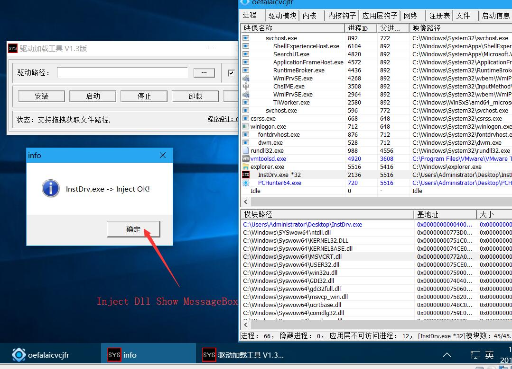

# DriverInjectDll

## Introduction
 
Using Driver Global Injection dll, it can hide DLL modules. You need to determine the process name you want in DllMain

## Develop

#### DriverInjectDll
driver program

#### Input_dll
Tell the driver to inject DLL binary data

#### Loader
Shelcode for Memory Loaded DLL

dll_x86.h -> inject x86 process dll bin binary data

dll_x86.h -> inject x64 process dll bin binary data

# Build
vs2008-vs2017
wdk7-wdk10

# How Use
step1: install and start driver program
step2: run Input_dll.exe

# screen snapshot 

## Support

Win7-Win10 x64